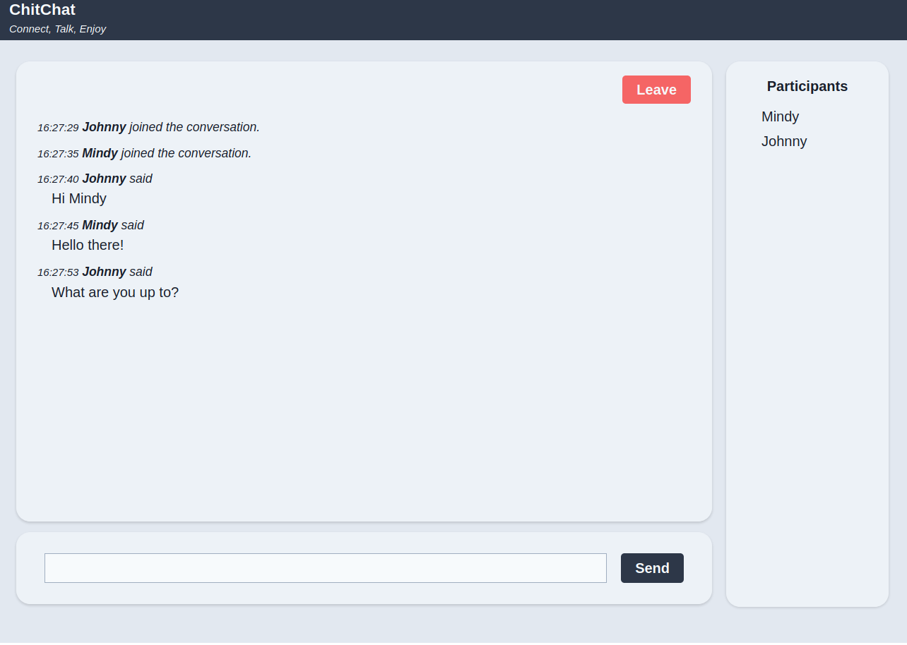

# ChitChat

[Live version](https://chitchat-client.netlify.app) _Note that it may take a while for it to start working because the app might be dormant_

[Server repository](https://github.com/arturjzapater/chitchat-server)

Chitchat is a chatting webapp. This client is written using [TypeScript](https://www.typescriptlang.org/), [Redux](https://redux.js.org/), [React](https://reactjs.org/), [Socket.IO](https://socket.io/) and [TailwindCSS](https://tailwindcss.com/).

## Install and Run

Clone and install its dependencies:

```bash
git@github.com:arturjzapater/chitchat-client.git
cd chitchat-client
npm i
```

To run the client in development mode, use:

```bash
npm start
```

To buid the project for production, use:

```bash
npm run build
```

## Test

This project uses [mocha](https://mochajs.org/) as its testing library.

To run unit tests, use:

```bash
npm t
```

The end-to-end tests are located in the server repository. See the [instructions here](https://github.com/arturjzapater/chitchat-server#test) to run them.

## Project Structure

Most of the project's code is in the [src](src) folder, which contains the following folders:

- [app](src/app): contains the application's main component([App](src/app/App.tsx)) as well as the [Header](src/app/Header.tsx) component and the store and reducer logic.
- [common](src/common): contains the application's utility functions and custom hooks.
- [css](src/css): contains the application's stylesheet.
- [features](src/features): contains the application's components organised by feature.
- [types](src/types): contains type declarations.

The application's [index](src/index.tsx) is located at the root of the [src](src) folder.

The [public](public) folder contains the html template.
The [config](config) folder contains configuration files for webpack and babel. It also contains the file [app.js](config/app.js), which exports an object with the following poperties:
- `debounceTiming`, which sets the number of milliseconds that the socket connection should wait after sending `user typing` event before it sends a new one.
- `server`, which is the url where the server is deployed.

## Considerations on the Structure

Following [Redux's recommendation](https://redux.js.org/style-guide/style-guide#structure-files-as-feature-folders-or-ducks), this project has been structured following the "feature folders" approach. All the files necessary to implement a feature are in the same folder. The goal is to have all the files that are closely related to one part of the application together to increase maintainability and readability.

## Considerations on Sockets

I created the custom hook [`useSocket`](src/common/Socket/useSocket.ts) to handle the logic pertaining to the socket connection. The hook returns a reference to the socket itself and the methods necessary to communicate with the server. The goal was to have all the logic pertaining to the socket connection in one place, so that it would be easy to maintain and integrate with new parts of the application if it grows to be more complex.

## Screenshots


